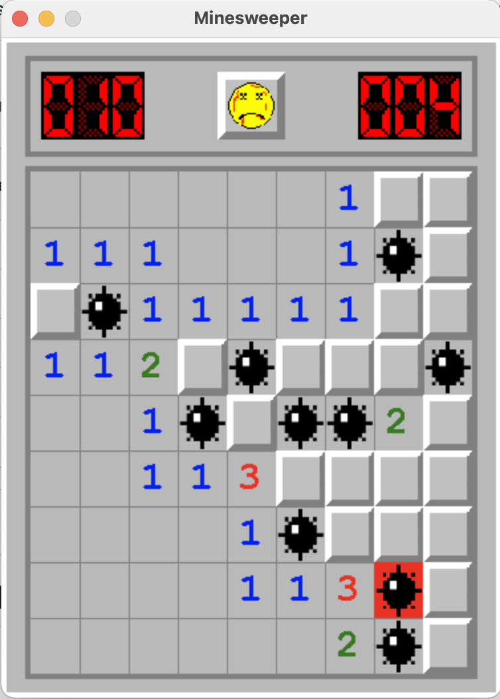

## MINESW33PER

Re-making of the original Minesweeper game that was bundled with Windows.

### Screenshot
{ width=50%, height=50% }

### How To Run (Easy)
`.app` binaries can be downloaded from the [releases](https://github.com/magidandrew/minesweeper/releases/) page.

### Run From Source
`pip` is required.
You can install deps and run the game with:
```
$ python3 setup.py install # run this once
$ python3 minesweeper/main.py
```
